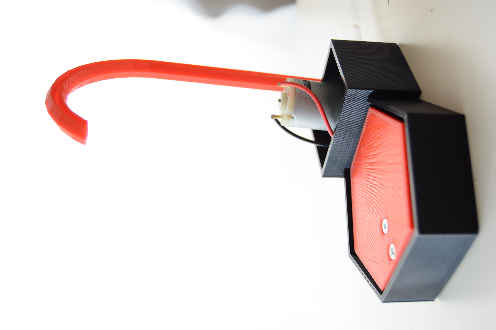
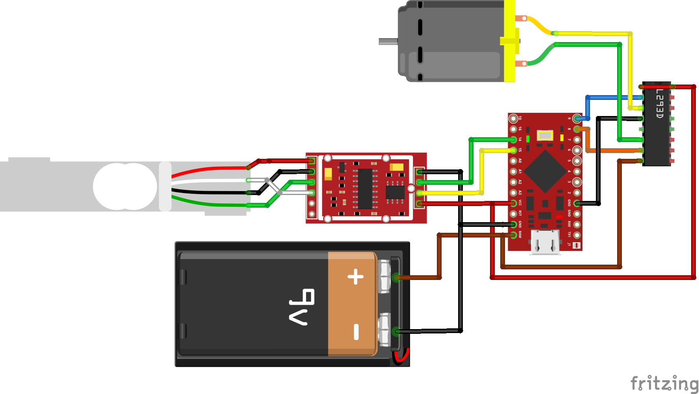

# episode_waterboy
Design and code-files for the waterboy episode

# Finished project

# Circuit schematic

# Parts-list:

* Arduino Pro Micro
* 12V power supply
* 1kg load cell and HX711 amplifier (https://www.amazon.de/gp/product/B0769FZ7NB/ref=oh_aui_detailpage_o08_s01?ie=UTF8&psc=1)
* L293D motor driver
* 12V peristaltic pump (https://www.amazon.de/gp/product/B017NFFLMG/ref=oh_aui_detailpage_o08_s01?ie=UTF8&psc=1)
* Flexible PVC tube (https://www.amazon.de/gp/product/B078YVXL2X/ref=oh_aui_detailpage_o07_s00?ie=UTF8&psc=1)

